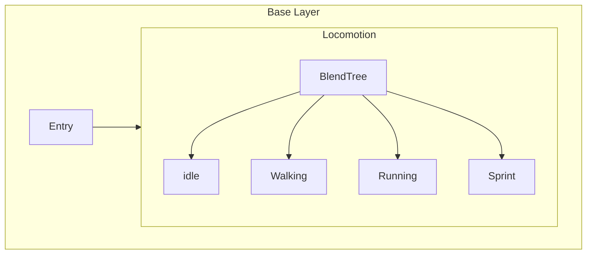
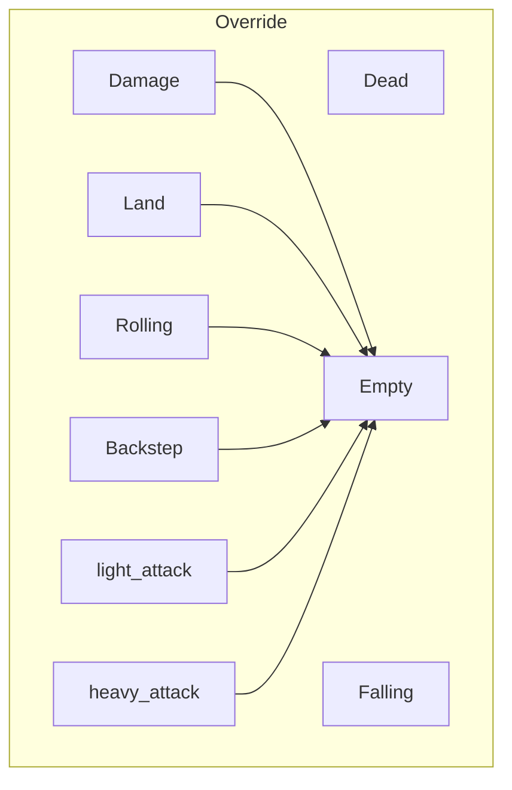

## State Machine

### Base Layer

#### Locomotion

- Is Blend Tree
- Include **idle, walking, Running, Sprint** etc basic motion
- Change Position y(move forward) to set move position of motion

| Motion  | Pos X | Pos Y |
| ------- | ----- | ----- |
| idle    | 0     | 0     |
| Walking | 0     | 0.5   |
| Running | 0     | 1     |
| Sprint  | 0     | 2     |





### Override(Layer)

- Set **Weight to 1** in ⚙️
- Select Blending to **Override**
  - Use **Override** to replace the animation on previous layers
  - Use **Additive** to add the animation on top of the animation from previous layers
- Create new state **Empty**
- Create new scripts name **ResetAnimatorBool** in **Empty** to reset animation

```csharp
pubic class ResetAnimatorBool: StateMachineBehaviour //notice class
{
  public string targetBool;
  public bool status;
  
  public override void OnStateEnter(Animator animator, AnimatorStateInfo stateInfo, int layerIndex)
  {
    animator.SetBool(targetBool, status);
  }
}
```





## Parameters

| Type | Name          | Default Value | memo                                      |
| ---- | ------------- | ------------- | ----------------------------------------- |
| int  | Vectical      | 0             | input value, quote in **AnimatorHandler** |
| int  | Horizontal    | 0             | input value, quote in **AnimatorHandler** |
| bool | isInteracting | false         |                                           |
| bool | canDoCombo    | false         |                                           |

