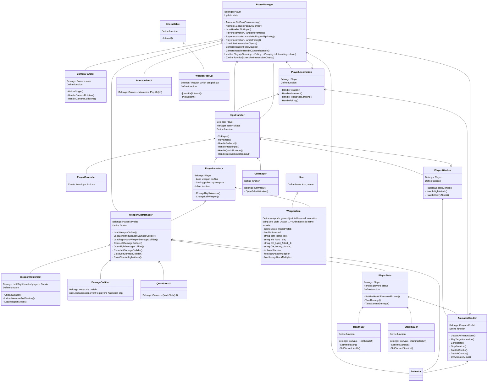

## 结构



## Input system

1. 安装新版 **InputSystem** 之后，右键新建 Input Actions（命名为 **PlayerController**），生成一个 c# 文件

2. 在 `InputHandler` 中直接调用.
  
   ```csharp
   PlayerController inputActions;
   
   private void OnEnable(){
       if (inputActions == null){
   
       inputActions = new PlayerController;
   
       }
   }
   ```


### Walk

调用 input Actions 里的按键 - 移动

```csharp
public Vector2 movementInput;
PlayerController inputActions;

inputActions.Player.Move.performed += keyboardInput => movementInput = keyboardInput.ReadValue<Vector2>();
```

- inputAction：PlayerController’s name
- Player：Action Map’s name
- Move：Action’s name
- keyboardInput：临时变量，用于传递变量值


### Attack

- 判断按键是否被按下，如果按下，调用 **playerAttacker** 里的 **HandleLightAttack** 方法

- **HandleLightAttack** 方法执行对应的 **animation**
- 武器的伤害用挂载在武器 prefab 上的 **DamageCollider** 脚本触发

```csharp
public bool rb_input; 

inputActions.Player.RightButton.performed += i => rb_input = true;
```


