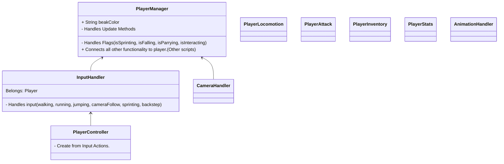

# 结构



## 关于 Input system

1. 安装新版 **InputSystem** 之后，右键新建 Input Actions , 生成一个 c# 文件

2. 在 `InputHandler` 中直接调用
  
   ```csharp
   InputActions inputActions;
   
   private void OnEnable(){
       if (inputActions == null){
   
       inputActions = new InputActions;
   
       }
   }
   ```


